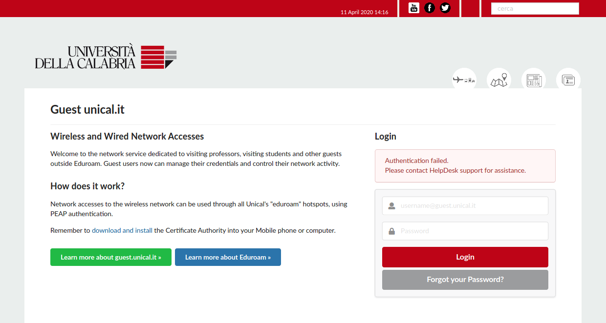
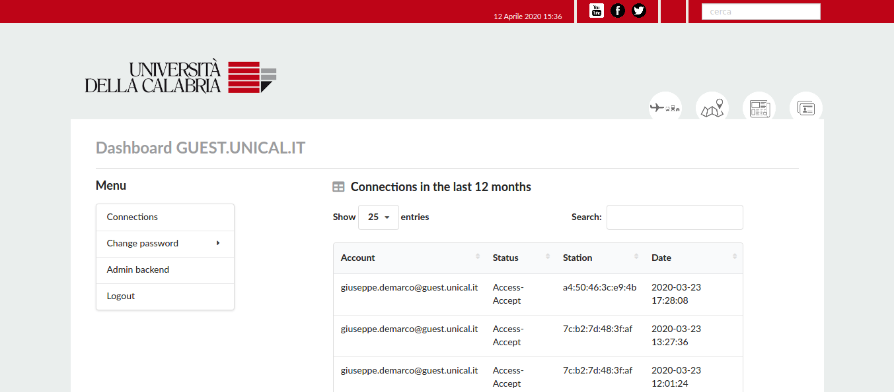
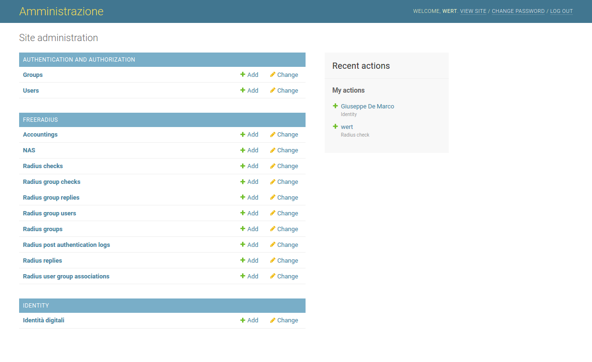

Django Freeradius Manager
---------------------------

Django Freeradius Manager is an Admin interface to a Freeradius 3 RDBMS with Identity Management and Credentials Provisioning.
This project is built on top of a simplified fork of [django-freeradius](https://github.com/openwisp/django-freeradius) from [OpenWISP Project](http://openwisp.org/).

#### Description

This project is composed by two components:

- django-freeradius for managing definitions in a freeradius RDBMS schema
- identity app

Freeradius definitions can be managed directly using the Django Admin Model Backend, as it come from [django-freeradius](https://github.com/openwisp/django-freeradius).

The Identity Provisioning procedure is handled in the Identity App, for each Digital Identity we can have one or more RadiusCheck accounts and provisioning tokens. An Admin action can send via email the activation token to the users, through which these can enable their accounts and configure their passwords. If a user forgot his password he can request a token to be sent to his delivery, to reset its account.

All the parameters and configuration of these applications can be found in the `settings.py` file in the app folder, these can be also redefined (overloaded) in the global `settingslocal.py` file.

#### Main features

- Full localization support based on Django
- Identity management
- Expirable Freeradius accounts
- Credentials provisioning through expirable Token sent via email
- Users can view all their connections and devices in a responsive Ajax DataTable
- Importable identities via a [CSV file](freerad_manager/static/template_accounts.csv). Only __first_name__, __last_name__ and __email__ are mandatory. 
- Many Freeradius Accounts to one identity


### Gallery
-------------------------------------------------



------------------------------------------------

#### Setup

Freeradius and RDBMS installation
````
apt install freeradius freeradius-mysql mariadb-server
````

Install Django things
````
apt install python3 python3-dev libmariadbclient-dev python3-pip
git clone https://github.com/UniversitaDellaCalabria/django-freeradius-manager.git
cd django-freeradius-manager

pip3 install virtualenv
virtualenv -ppython3 env
source env/bin/activate

pip3 install -r requirements.txt
````

Copy `freerad_manager/settingslocal.py.example` to `freerad_manager/settingslocal.py` and customize all the params you need.

Create a Database for this project and put these credentials in `freerad_manager/settingslocal.py`
````
sudo mysql -u root -e "CREATE DATABASE IF NOT EXISTS radius; GRANT ALL ON radius.* TO radius@'%' IDENTIFIED BY '$RADIUS_PWD'; \
flush privileges;"
````

An example of `freerad_manager/settingslocal.py` configuration here
````
DATABASES = {
    'default': {
        'ENGINE': 'django.db.backends.mysql',
        'NAME': 'radius',
        'HOST': '10.0.3.85',
        'USER': 'radius',
        'PASSWORD': 'radiussecret',
        'PORT': '',
    }
}
````

Create Django models
--------------------

````
cd freerad_manager
./manage.py migrate
./manage.py createsuperuser
./manage.py runserver
````

Configure Freeradius
````
export RADCONFD="/etc/freeradius/3.0/"
export RADIUS_PWD="radiussecret"

systemctl freeradius stop

pushd $RADCONFD

# this is useless because django-freeradius-manager creates automatically the database
# otherwise create a db with these schemas
# find . -type f | grep schema.sql  | grep mysql | grep main | grep -v extras
# mysql -u radius --password=$RADIUS_PWD radius < $RADCONFD./mods-config/sql/main/mysql/schema.sql

# configure mysql db connection
sed -i 's/.*driver = "rlm_sql_null"/driver = "rlm_sql_mysql"/' $RADCONFD/mods-available/sql
sed -i 's/dialect = "sqlite"/dialect = "mysql"/' $RADCONFD/mods-available/sql
sed -i 's/#.*server = "localhost"/       server = "localhost"/' $RADCONFD/mods-available/sql
sed -i 's/#.*port = 3306/       port = 3306/' $RADCONFD/mods-available/sql
sed -i 's/#.*login = "radius"/        login = "radius"/' $RADCONFD/mods-available/sql
sed -i 's/#.*password = "radpass"/        password = "'$RADIUS_PWD'"/' $RADCONFD/mods-available/sql

# sqlcounter patch
sed -i 's|dialect = ${modules.sql.dialect}|dialect = mysql|g' $RADCONFD/mods-available/sqlcounter

# enable mysql module
ln -s $RADCONFD/mods-available/sql        $RADCONFD/mods-enabled/
ln -s $RADCONFD/mods-available/sqlcounter $RADCONFD/mods-enabled/

# auth
# inner-tunnel
sed -i 's|session {|session {\nsql|' $RADCONFD/sites-enabled/inner-tunnel
# default
sed -i 's|session {|session {\nsql|' $RADCONFD/sites-enabled/default
sed -i 's|accounting {|accounting {\nsql|' $RADCONFD/sites-enabled/default

# disable unused eap methods
sed -i 's|default_eap_type = md5|default_eap_type = peap|' $RADCONFD/mods-available/eap

# also rememebr to disable md5 auth in eap module ...

# logging
# it could be done also with this:
# radiusconfig -setconfig auth yes
# radiusconfig -setconfig auth_badpass yes
# sed -i 's|logdir = ${localstatedir}/log/radius|logdir = /var/log/radius|' $RADCONFD/radiusd.conf
# sed -i 's|auth_badpass = no|auth_badpass = yes|g' $RADCONFD/radiusd.conf
# sed -i 's|auth_goodpass = no|auth_goodpass = yes|g' $RADCONFD/radiusd.conf
sed -i 's|auth = no|auth = yes|g' $RADCONFD/radiusd.conf

# better use those in RDBMS ...
# accounting logs, readable in $logdir/acct/*
# sed -i 's|#.*auth_log|auth_log|' $RADCONFD/sites-enabled/default
# sed -i 's|#\s*reply_log$|reply_log|' $RADCONFD/sites-enabled/default
# radlast command workaround (.f option doesn't still work)
# mkdir -p /usr/local/var/log/radius/
# ln -s /var/log/freeradius/radwtmp /usr/local/var/log/radius/

systemctl enable freeradius
systemctl start freeradius
````

See `README_freeradius.md` for a fine tuning of SQL queries.

Create a django freeradius account via Django admin backend, then test it
````
radtest -t mschap username password localhost 0 testing123
````

#### Users that acts as Accounts Managers

Users can have multiple freeradius accounts. Everytime they log in the system using a freeradius account
they can see all the owned freeradius accounts and change passwords.

If instead an user would like to be an __account manager__ 
he should be configured in the system as `User.is_staff = True`.
When one of the freeradius accounts owned by an __account manager__ accesses to the system this can only see the connections
of the current freeradius account used to log in, and not all the other accounts owned by the
parent identity (the account manager). That's a good strategy for managers that wants to handle
many accounts, belonging to his identity, and share them to their collaborators.


#### Tests

````
pip3 install -r requirements-dev.txt
cd freerad_manager

# run
./manage.py test  --settings=tests.settings
#or
DJANGO_SETTINGS_MODULE=tests.settings pytest ./tests/test_01.py -x
````

#### Production use

see `uwsgi_setup` folder for examples. Remember to run `./manage.py collectstatic` to populate the `static` folder.


#### Credits

- [OpenWISP](http://openwisp.org/) community
- Francesco Izzi (CNR IMAA)


#### Authors

- Giuseppe De Marco <giuseppe.demarco@unical.it>


#### Additional Resources

- [Assignign VLANID](https://linuskarlsson.se/blog/radius-authentication-and-dynamic-vlan-assignment-for-wpa2-enterprise-using-sqlite-in-freeradius/) 
